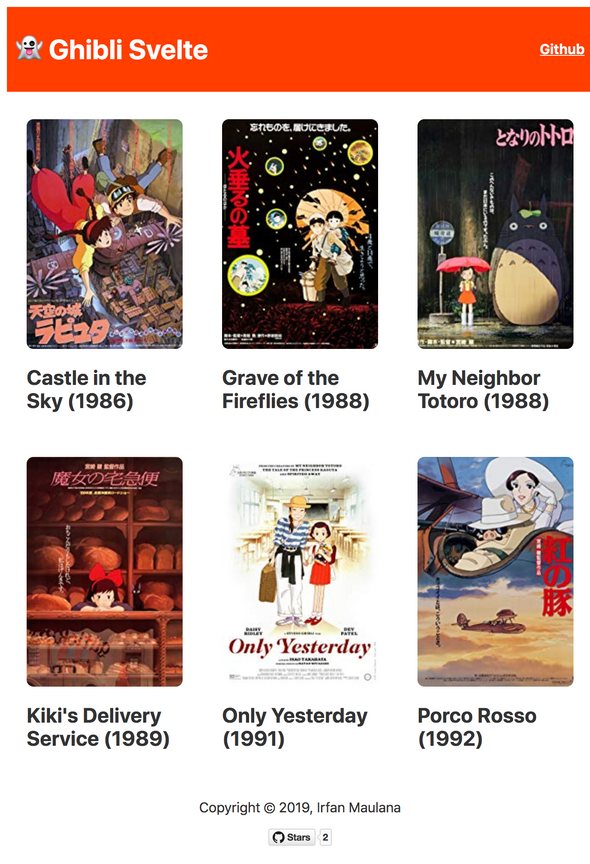

# Ghibli Svelte

[](https://reasonml.github.io/ghibli-svelte/) 

👻 Ghibli studio's film explorer built with [Svelte](https://svelte.dev)

## Live Demo

[https://ghibli-svelte.surge.sh/](https://ghibli-svelte.surge.sh/)

## Screenshoot



## Development

+ You can run the app locally with:

```bash
yarn dev
```

+ Build for production with:

```bash
yarn build
```

## Credits

+ [Svelte](https://svelte.dev)
+ [Janaipakos](https://github.com/janaipakos) for awesome [Ghibli Studio API](https://ghibliapi.herokuapp.com/)

---

Copyright © 2019 by Irfan Maulana
